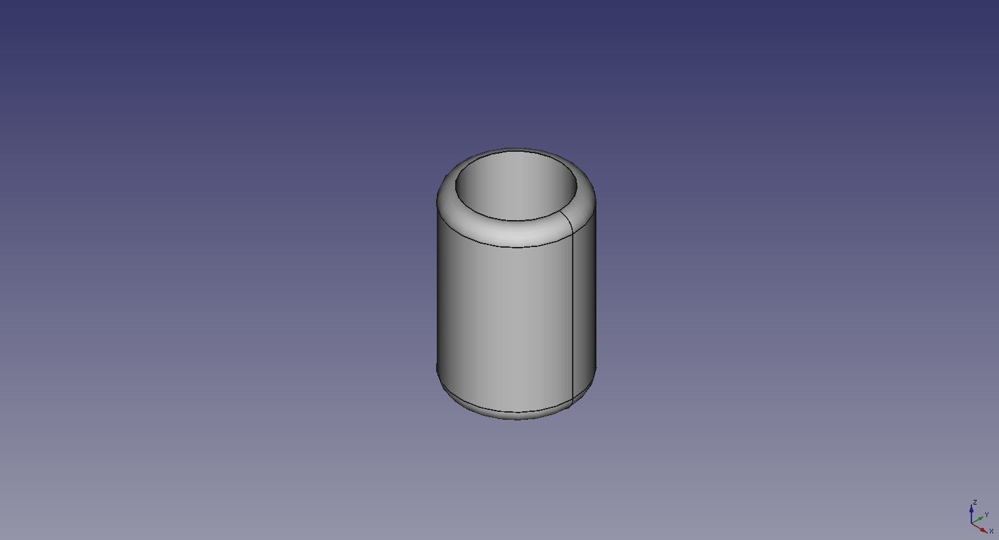
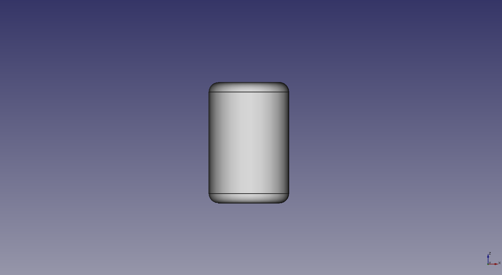
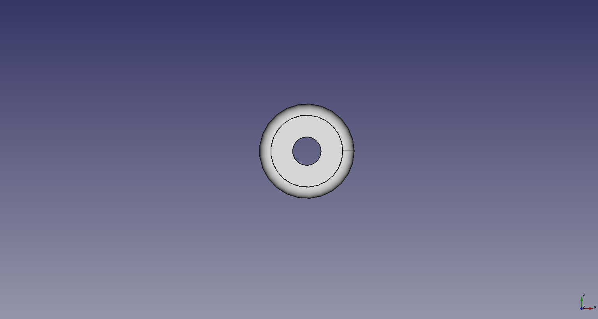
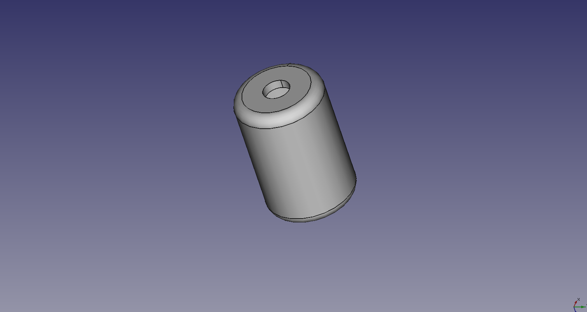

# Universal Filament Filter (Printed One)

A simple filament filter.

Use extrusion force to clean the filament.

1.75mm version
2.85mm version (This one can be used for the 1.75mm too) (two in one)

##License

Licensed under a Creative Commons Attribution-ShareAlike 4.0 International License. 

Please read the LICENSE files for more details.
